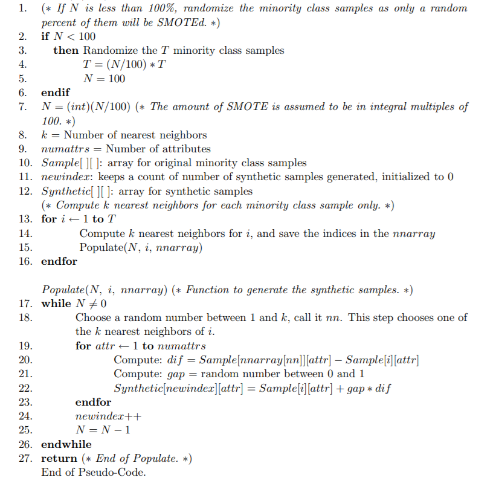

<head>
    
    
</head>

README
===========================

General description for cancermlpipeline
We provide info on:
-How to
-How to
-How to 

****

|Author|ChengChen|
|---|---|
|E-mail|3150105343@zju.edu.cn|

|Author|Ling Tianyi|
|---|---|
|E-mail|3160102182@zju.edu.cn|

## Table of Contents

* [Abstract](#abstract)
* [Algorithm](#algorithm)
* [Useful Scripts](#useful-script)
   * [Script dependencies](#script-dependencies)
   * [Run_Prediction.py](#Run_Prediction.py)
   * [Prediction.R](#prediction)
* [Data](#data)
  
   * [RNA-seq data](#RNAseq)
   * [Clinic Data](#clinicdata)
   * [Demo](#result-files)
* [Running Analyses from the Paper](#running-analyses-from-the-paper)
* [Dependencies](#dependencies)
      * [Python](#python)
      * [R](#r)
      * [Compute Environment](#compute-environment)
      * [Data Downloads](#data-downloads)
  
   * [Running all analyses](#running-all-analyses)
* [Reference](#reference)

## Abstract

A plenty of previous work have been published related to gene signature for cancer diagnose and prognostic factor analysis and  formulating a standard pipeline to screen the gene signature for distinguishing patients with high risks from those with low-risks for cancer metastasis and predicting their prognosis have becoming one of the heating topic The goal of this study was to further screen the gene signature for classification of high and low risk of cancer metastasis using a gene expression profile dataset. And to evaluating the performance difference while applying various machine learning algorithms to identify signature genes and calculating risk index. We hope to establish a standardized pipeline for modeling on different cancers and the final result could be competitive among all published methods.

## Pipeline

### **Dataset**

We download TCGA dataset as demo data to perform our research. Compared to other dataset, TCGA data has a integrated clinic record include survival data, metastasis status and recurrence information, which are crucial to classifier in supervised learning. However, some aspects in TCGA  clinic data are quite imbalance in scale such as metastasis rates in breast cancer(the metastasis probability is less than 1/10 in total due to its high benign rate. We strongly suggest to balance the data (use such as SMOTE or modify cost matrix ) before apply modeling methods in order to achieve both satisfied AOC and precision

### **Normalization** 

Before the modeling procedure, normalization and gene prefiltering should be taken as roughly dimension reduction method. We only apply genes are variable and meet the Standard Variance cutoff and have a normal expression level among all examples (to filter out mt genes ) We do not use a Differential expressed genes list given by edgeR or Deseq because these packages calculate DE genes across different labeled batches and only keep genes with a significant logfoldchange difference. We regard this kind of anticipated filter will leave out some important genes and have too many manually control factor, thus we use Standard Variance cutoff to keep top 2000 genes and use these genes to construct machine learning models.

### **Feature select** 

To build up our classifier, we need to select the most meaningful features (gene) from 2000 filtered gene profiling. By using machine learning methods such as random forest and  SVMRFECV, we concluded a 20 gene list that may explain the RNA pattern difference between metastasis patient and those who don’t. And use this 20 gene list as the feature vector used in following classifier.

### Modeling & Evaluating 

Our classifier is to identify easy-to- [metastasis](javascript:;) cancer in [primary](javascript:;) cancer’ RNAseq samples and to apply this model to predict the risk of  cancer metastasis in. Models are evaluated by AUC and precision and different algorithms are compared to achieve best performance in dataset

### Risk analysis 

Another approach that could measure the performance of our model is to associate our gene list with the clinic survival data. Cancer metastasis strongly effect patients’ life expectation and prognostic condition. We calculate risk index and use survival test to analysis the correlation between computational result and biological meaning.

## Algorithm

### Imbalance data Preprocessing

Data Imbalance can be of the following types:

1. *Under-representation of a class in one or more important predictor variables.* 
2. *Under-representation of one class in the outcome (dependent) variable.* 

In out demo, we want to predict, from a large clinical phenotype dataset, which patients are labeled with the stage of their cancer's metastasis conditions. However, that only 16% of patients labeled with M1 or other detected metastasis stages, and it's quite normal in other TCGA cancer metastasis datasets. Therefore our prediction task is a complex mission with $typeII$ imbalance data.

**The solutions can mainly divided into two aspects.** The first dimension is mainly from the layer of raw-data. And the main method is sampling. Since our demo metastasis data are unbalanced, we can sample them by some strategies, so that our data can be relatively balanced. The second schemes optimize the algorithm from the perspective of the algorithm, considering the difference in the cost of different misclassifications, so that our algorithm can also have better results under unbalanced data.

In our scripts, we take both of them into consideration.

#### SMOTE

**Oversampling** and **undersampling** in data analysis are techniques used to adjust the class distribution of a dataset (i.e. the ratio between the different classes/categories represented). 

>From Nitesh V. Chawla, Kevin W. Bowyer, Lawrence O. Hall and W. Philip Kegelmeyer’s **“SMOTE: Synthetic Minority Over-sampling Technique”** (Journal of Artificial Intelligence Research, 2002, Vol. 16, pp. 321–357): “This paper shows that a combination of our method of over-sampling the minority (abnormal) class and under-sampling the majority (normal) class can achieve better classifier performance (in ROC space) than only under-sampling the majority class. This paper also shows that a combination of our method of over-sampling the minority class and under-sampling the majority class can achieve better classifier performance (in ROC space) than varying the loss ratios in Ripper or class priors in Naive-Bayes. Our method of over-sampling the minority class involves creating synthetic minority class examples.”

**SMOTE** is an improved scheme based on random oversampling algorithm. For random oversampling adopts the strategy of simply copying samples to increase the minority samples, it is prone to problem of overfitting, which makes the information learned by the model too special (Specific ) and not generalized, the basic idea of the SMOTE algorithm is to analyze a small number of samples and add new samples to the data set based on a small number of samples. 

**The algorithm flow** is as follows:

1. For each sample $x$ in a few classes, calculate the distance from all samples in a few sample sets by Euclidean distance, and get its $k-nearest neighbors$.

2. Set a sampling ratio according to the sample imbalance ratio to determine the sampling magnification $N$. For each minority sample $x$, randomly select several samples from its $k-nearest neighbors$, assuming that the selected neighbor is $\hat{x}$ .

3. For each randomly selected neighbor $\hat{x}$, construct a new sample with the original sample according to the following formula
   $$
   x_{new} = x + rand(0, 1) × (\hat{x}-x)
   $$

   

       
        
       
sketch map of SMOTE

   

   

**The main pseudo-code**:

***Algorithm SMOTE(T, N, k)***
**Input:**  *Number of minority class samples T; Amount of SMOTE N%; Number of nearest*
*neighbors k*
**Output:** *(N/100) \* T synthetic minority class samples*

<B>pseudo-code of SMOTE</B>

The SMOTE algorithm discards the practice of random oversampling and replicating samples, which can prevent the problem of random oversampling and over-fitting. It has been proved that this method can improve the performance of the classifier.

#### Cost Matrix and class_weight

Sampling algorithm solves the problem of imbalance data ML from the data level. And the other method of solving unbalanced disaster in ML is mainly based on Cost-Sensitive Learning. The core element of cost-sensitive learning method is the cost matrix. It is noted that the cost of different types of misclassifications in actual applications is different. For example, in medical treatment, the cost of “diagnosing patients as healthy people” and “diagnosing healthy people as patients” are different.

For how `class_weight` works: It penalizes mistakes in samples of `class[i]` with `class_weight[i]`instead of 1. So higher class-weight means you want to put more emphasis on a class. From what you say it seems class 0 is 19 times more frequent than class 1. So you should increase the `class_weight` of class 1 relative to class 0, say {0:.1, 1:.9}. If the `class_weight` doesn't sum to 1, it will basically change the regularization parameter.

### Feature Selection

#### Random forest

#### SVMRFECV

### Classification Prediction

#### Logistic Regression

#### SVM

#### Naive-bayes

#### KNN

#### Gradient-boosting

#### Random forest

### Evaluation index

#### SHAP value

#### Accuracy and F1 score

#### ROC curve and AUC

## Useful Scripts

### Script dependencies

dependencies 

### Run_Prediction.py
balabala

### prediction.R

## Data

### RNAseq data

### Clinic data

### Demo

##  Running Analyses from the Paper

## Dependencies

### R

### Python

### Data Downloads

## Reference