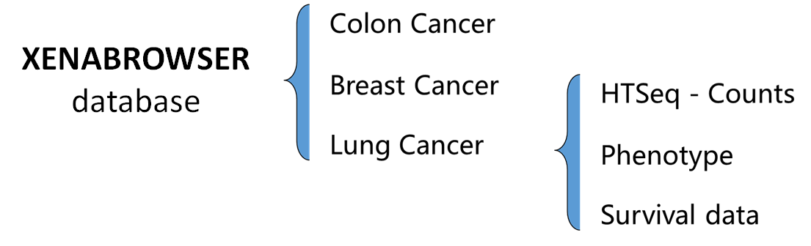
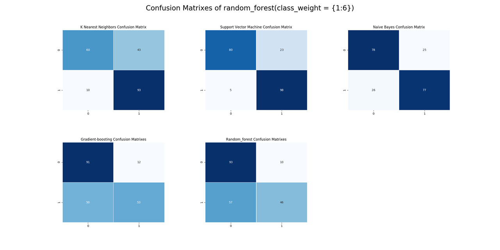

README/符合医学诊断标准的标准化流程构建
===========================

A standardized evaluation pipeline for cancer metastasis based on machine learning methods, which is a  bioinformatic lecture project created by Chenchen and Ling Tianyi, trying to improve existed pipeline for generating risk evaluation index and applying different machine learning algorithm to gain a explanatory model with biological significance.

We hope to establish **a standardized pipeline for modeling on different cancers** and the final result could be competitive among all published methods.

**We provide info on:**

- How to obtain and preprocess gene expression profile dataset
- How to screen signature genes related to cancer metastasis with machine learning methods
- How to evaluating the performance of the predictive model based on screened signature genes
- How to calculating risk index (*under construction*)


****

|Author|Cheng Chen|
|---|---|
|E-mail|3150105343@zju.edu.cn|

|Author|Ling Tianyi|
|---|---|
|E-mail|3160102182@zju.edu.cn|

[Github地址]( https://github.com/Seasonsling/cancermlpipeline )：https://github.com/Seasonsling/cancermlpipeline

  


## **Table of Contents**

[TOC]

## **1. Abstract**

A plenty of previous work have been published related to gene signature for cancer diagnose and prognostic factor analysis, and  formulating a standard pipeline to screen the gene signature for distinguishing patients with high risks from those with low-risks for cancer metastasis. And predicting their prognosis have becoming one of the heating topic. The goal of this study was to further screen the gene signature for classification of high and low risk of cancer metastasis using a gene expression profile dataset. And to evaluating the performance difference while applying various machine learning algorithms to identify signature genes and calculating risk index. We hope to establish a standardized pipeline for modeling on different cancers and the final result could be competitive among all published methods.


## **2. Pipeline**

### 2.1 Dataset

We download TCGA dataset as demo data to perform our research. Compared to other dataset, TCGA data has a integrated clinic record include survival data, metastasis status and recurrence information, which are crucial to classifier in supervised learning. However, some aspects in TCGA  clinic data are quite imbalance in scale such as metastasis rates in breast cancer(the metastasis probability is less than 1/10 in total due to its high benign rate. We strongly suggest to balance the data (use such as SMOTE or modify cost matrix ) before apply modeling methods in order to achieve both satisfied AOC and precision

### 2.2 Normalization

Before the modeling procedure, normalization and gene prefiltering should be taken as roughly dimension reduction method. We only apply genes are variable and meet the Standard Variance cutoff and have a normal expression level among all examples (to filter out mt genes ) We do not use a Differential expressed genes list given by edgeR or Deseq because these packages calculate DE genes across different labeled batches and only keep genes with a significant logfoldchange difference. We regard this kind of anticipated filter will leave out some important genes and have too many manually control factor, thus we use Standard Variance cutoff to keep top 2000 genes and use these genes to construct machine learning models.

### 2.3 Feature select

To build up our classifier, we need to select the most meaningful features (gene) from 2000 filtered gene profiling. By using machine learning methods such as random forest and  SVMRFECV, we concluded a 20 gene list that may explain the RNA pattern difference between metastasis patient and those who don’t. And use this 20 gene list as the feature vector used in following classifier.

### 2.4 Modeling & Evaluating

Our classifier is to identify easy-to- [metastasis](javascript:;) cancer in [primary](javascript:;) cancer’ RNAseq samples and to apply this model to predict the risk of  cancer metastasis in. Models are evaluated by AUC and precision and different algorithms are compared to achieve best performance in dataset

### 2.5 Risk analysis

Another approach that could measure the performance of our model is to associate our gene list with the clinic survival data. Cancer metastasis strongly effect patients’ life expectation and prognostic condition. We calculate risk index and use survival test to analysis the correlation between computational result and biological meaning.


## **3. Algorithm**

### 3.1 Imbalance data Preprocessing

Data Imbalance can be of the following types:

1. *Under-representation of a class in one or more important predictor variables.* 
2. *Under-representation of one class in the outcome (dependent) variable.* 

In out demo, we want to predict, from a large clinical phenotype dataset, which patients are labeled with the stage of their cancer's metastasis conditions. However, that only 16% of patients labeled with M1 or other detected metastasis stages, and it's quite normal in other TCGA cancer metastasis datasets. Therefore our prediction task is a complex mission with $typeII$ imbalance data.

**The solutions can mainly divided into two aspects.** The first dimension is mainly from the layer of raw-data. And the main method is sampling. Since our demo metastasis data are unbalanced, we can sample them by some strategies, so that our data can be relatively balanced. The second schemes optimize the algorithm from the perspective of the algorithm, considering the difference in the cost of different misclassifications, so that our algorithm can also have better results under unbalanced data.

In our scripts, we take both of them into consideration.

#### SMOTE

**Oversampling** and **undersampling** in data analysis are techniques used to adjust the class distribution of a dataset (i.e. the ratio between the different classes/categories represented). 

>From Nitesh V. Chawla, Kevin W. Bowyer, Lawrence O. Hall and W. Philip Kegelmeyer’s **“SMOTE: Synthetic Minority Over-sampling Technique”** (Journal of Artificial Intelligence Research, 2002, Vol. 16, pp. 321–357): “This paper shows that a combination of our method of over-sampling the minority (abnormal) class and under-sampling the majority (normal) class can achieve better classifier performance (in ROC space) than only under-sampling the majority class. This paper also shows that a combination of our method of over-sampling the minority class and under-sampling the majority class can achieve better classifier performance (in ROC space) than varying the loss ratios in Ripper or class priors in Naive-Bayes. Our method of over-sampling the minority class involves creating synthetic minority class examples.”

**SMOTE** is an improved scheme based on random oversampling algorithm. For random oversampling adopts the strategy of simply copying samples to increase the minority samples, it is prone to problem of overfitting, which makes the information learned by the model too special (Specific ) and not generalized, the basic idea of the SMOTE algorithm is to analyze a small number of samples and add new samples to the data set based on a small number of samples. 

**The algorithm flow** is as follows:

1. For each sample $x$ in a few classes, calculate the distance from all samples in a few sample sets by Euclidean distance, and get its *k-nearest neighbors*​.

2. Set a sampling ratio according to the sample imbalance ratio to determine the sampling magnification *N*. For each minority sample , randomly select several samples from its *k-nearest neighbors*, assuming that the selected neighbor is  .

3. For each randomly selected neighbor , construct a new sample with the original sample according to the following formula
  
   
   
<div align = center>
     
    <div><B><i>Figure1</i> sketch map of SMOTE</B></div>
   </div>

**The main pseudo-code**:

***Algorithm SMOTE(T, N, k)***
**Input:**  *Number of minority class samples T; Amount of SMOTE N%; Number of nearest*
*neighbors k*
**Output:** *(N/100) \* T synthetic minority class samples*

<div>
  
  <div align = "center"><B>pseudo-code of SMOTE</B></div>
</div>


The SMOTE algorithm discards the practice of random oversampling and replicating samples, which can prevent the problem of random oversampling and over-fitting. It has been proved that this method can improve the performance of the classifier.


#### Cost Matrix and class_weight

Sampling algorithm solves the problem of imbalance data ML from the data level. And the other method of solving unbalanced disaster in ML is mainly based on Cost-Sensitive Learning. The core element of cost-sensitive learning method is the cost matrix. It is noted that the cost of different types of misclassifications in actual applications is different. For example, in our cancer metastatic predictive model, the cost of “diagnosing healthy people as tumor metastatic ” and “diagnosing recurrence patients as normal” are different, obviously the latter requires higher penalty weight.

Since we mainly use the python package of `sklearn` in feature selecting and modeling, another parameter  named "class_weight" also worth mentioning.

Here is how `class_weight` works: It penalizes mistakes in samples of `class[i]` with `class_weight[i]`instead of 1. So higher class-weight means you want to put more emphasis on a class. From what you say it seems class 0 is 19 times more frequent than class 1. So you should increase the `class_weight` of class 1 relative to class 0, say {0:.1, 1:.9}. If the `class_weight` doesn't sum to 1, it will basically change the regularization parameter.


### 3.2 Feature Selection

In machine learning and statistics, feature selection, also known as variable selection, attribute selection or variable subset selection, is the process of selecting a subset of relevant features (variables, predictors) for use in model construction. 

The benefits of performing feature selection before modeling our data can be illustrate as follows:

1. **Reduces Overfitting**: Less redundant data means less opportunity to make decisions based on noise.

2. **Improves Accuracy**: Less misleading data means modeling accuracy improves.
3. **Reduces Training Time**: fewer data points reduce algorithm complexity and algorithms train faster.

And to build up our classifier, we select the most meaningful 20 features (gene) from 2000 filtered gene profiling, and the evaluation results proves the effectiveness of feature selection.

<a href="random"> </a>

#### Random forest

Random forests are among the most popular machine learning methods thanks to their relatively good accuracy, robustness and ease of use. They also provide two straightforward methods for feature selection: mean decrease impurity and mean decrease accuracy. And  we apply the mean decrease impurity method in our program. 

Random forest consists of a number of decision trees. Every node in the decision trees is a condition on a single feature, designed to split the dataset into two so that similar response values end up in the same set. The measure based on which the (locally) optimal condition is chosen is called impurity. For classification, it is typically either [Gini impurity](http://en.wikipedia.org/wiki/Decision_tree_learning#Gini_impurity) or [information gain/entropy](http://en.wikipedia.org/wiki/Information_gain_in_decision_trees) and for regression trees it is [variance](http://en.wikipedia.org/wiki/Variance). Thus when training a tree, it can be computed how much each feature decreases the weighted impurity in a tree. For a forest, the impurity decrease from each feature can be averaged and the features are ranked according to this measure.

but there are a few things to keep in mind when using the impurity based ranking. 

> Firstly, feature selection based on impurity reduction **is biased towards preferring variables with more categories**. Secondly, when the **dataset has two (or more) correlated features, then from the point of view of the model, any of these correlated features can be used as the predictor**, with no concrete preference of one over the others. But once one of them is used, the importance of others is significantly reduced since effectively the impurity they can remove is already removed by the first feature. As a consequence, **they will have a lower reported importance**. Therefore when we interpret the data, it can lead to the incorrect conclusion that one of the variables is a strong predictor while the others in the same group are unimportant, while actually they are very close in terms of their relationship with the response variable.

Due to random forest algorithm meets difficulties when dealing with those features with high correlation, We tried another feature selection method which has been proved to handle this problem effectively: SVMRFECV.

<div>
  <div align = "center">
    <span style="position: absolute; top: 0px; left: 10px;"><B>A</B></span> 
  	 
    <span style="position: absolute; top: 0px; left: 490px;"><B>B</B></span> 
  	
  </div>	
    <div align = "left"><br><B><i>Figure2 A) Sturcture of randomforest.</i></B> It randomize the variables (columns) and data (rows), generates thousands of classification trees, and then summarize the results of the classification tree. <B><i>B) Importance of top 20 features(genes)</i></B></div>
</div>

<<<<<<< HEAD

=======
>>>>>>> 485e31b9e34ee0f317b28bed2051b4a42e202bf9
#### SVMRFECV

SVM-RFE was introduced by Guyon et al. for selecting genes from microarray data analysis for cancer classification. It includes four steps: 

​	1) Train an SVM on the training set; 

​	2) calculate ranking criteria based on the SVM weights; 

​	3) Eliminate features with the smallest ranking criterion; and 

​	4) Repeat the process. 

The feature elimination method **is sensitive to small perturbations of the training set**. The features it extracts from training set might not have good prediction performance in an independent testing set. And Fan Zhang .etc(2013, [BMC Med Genomics](https://www.ncbi.nlm.nih.gov/pmc/articles/PMC3552693/#)) adopted leave-one-out cross validation method to improve the stability and robustness of SVM-RFE. In addition, they chose |*W*| as ranking criteria instead of $W^2 $in the SVM-RFE-CV algorithm. The SVM-RFE chose $C_i = W^2_i$ as ranking criteria and eliminates the feature with smallest ranking criterion. The original optimization equation in SVM actually depends on the absolute value of weight $|W|$. Substituting $½W^2$ for $|W|$ can change the non-convex optimization to a quadratic programming optimization which is more easy to solve mathematically. But when we loop the feature elimination based on leave-one-out cross-validation, $½W^2$ loses its advantages over $|W|$ on convexity of optimization. And $|W|$ has bigger ranking criteria than$½W^2$, which makes optimization selection more accurate. Therefore, we chose $|W|$ as ranking criteria in the SVM-RFE-CV algorithm.

The SVM Recursive Feature Elimination method based on Cross-Validation (SVM-RFE-CV) is described as follows:

```pascal
k = **K**; *#*Select All features

for (i in 1:n) #n is the sample size
{
  Build a SVM using the ith sample as testing set and others as training set;
  Calculate the feature weight Wi and the error rate Ei;
}

Sum up weights: W = sum(abs(Wi));
Sum up error rates: E = sum(Ei);

E0 = E;
while (E < = E0)
{
  E0 = E;
  rkw = rank(W); #rank the feature score
  k = k[which(rkw > 1)]; # remove features with lowest feature score
  
  for (i in 1:n)
  {
     * Build a SVM using the ith sample as testing set and others as training set;
     * Calculate the feature weight Wi and the error rate Ei;
  }

  Sum up weights: W = sum(abs(Wi));
  Sum up error rates: E = sum(Ei);
}
```

The error rate is calculated by 1 minus accuracy. All error rates for the n cross validations are summed up as determination of loop iterations.


### 3.3 Classification & Prediction

Classification is the process of predicting the class of given data points. Classes are sometimes called as targets/ labels or categories. Classification predictive modeling is the task of approximating a mapping function (f) from input variables (X) to discrete output variables (y).

Classification belongs to the category of supervised learning where the targets also provided with the input data. There are many applications in classification in many domains such as in credit approval, medical diagnosis, target marketing etc.

There are two types of learners in classification as lazy learners and eager learners.

1. **Lazy learners**: Lazy learners simply store the training data and wait until a testing data appear. When it does, classification is conducted based on the most related data in the stored training data. Compared to eager learners, lazy learners have less training time but more time in predicting. 

    *Ex. k-nearest neighbor, Case-based reasoning*

2. **Eager learners**: Eager learners construct a classification model based on the given training data before receiving data for classification. It must be able to commit to a single hypothesis that covers the entire instance space. Due to the model construction, eager learners take a long time for train and less time to predict.

   *Ex. Decision Tree, Naive-Bayes, Artificial Neural Networks*

#### Logistic Regression

Logistic regression is a classification algorithm used to assign observations to a discrete set of classes. Unlike linear regression which outputs continuous number values, logistic regression transforms its output using the logistic sigmoid function to return a probability value which can then be mapped to two or more discrete classes.

#### SVM

**Support vector machines (SVMs)** are a set of supervised learning methods used for classification, regression and outliers detection. Intuitively, a good separation is achieved by the hyper-plane that has the largest distance to the nearest training data points of any class (so-called functional margin), since in general the larger the margin the lower the generalization error of the classifier.

<div align = center>
    
    <div><B><i>Figure3</i></B> SVM schematic</div>
</div>

The *kernel function* can be any of the following:

- linear: .
- polynomial:. dd is specified by keyword `degree`, rr by `coef0`.
- rbf: .  is specified by keyword `gamma`, must be greater than 0.
- sigmoid, where  is specified by `coef0`.

The advantages of support vector machines are:

> - Effective in high dimensional spaces.
> - Still effective in cases where number of dimensions is greater than the number of samples.
> - Uses a subset of training points in the decision function (called support vectors), so it is also memory efficient.
> - Versatile: different [Kernel functions](https://scikit-learn.org/stable/modules/svm.html#svm-kernels) can be specified for the decision function. Common kernels are provided, but it is also possible to specify custom kernels.

The disadvantages of support vector machines include:

> - If the number of features is much greater than the number of samples, avoid over-fitting in choosing [Kernel functions](https://scikit-learn.org/stable/modules/svm.html#svm-kernels) and regularization term is crucial.
> - SVMs do not directly provide probability estimates, these are calculated using an expensive five-fold cross-validation (see [Scores and probabilities](https://scikit-learn.org/stable/modules/svm.html#scores-probabilities), below).

#### Naive-bayes

Naive Bayes is a probabilistic classifier inspired by the Bayes theorem under a simple assumption which is the attributes are conditionally independent.


The classification is conducted by deriving the maximum posterior which is the maximal $P(C_i|X)$ with the above assumption applying to Bayes theorem. This assumption greatly reduces the computational cost by only counting the class distribution. Even though the assumption is not valid in most cases since the attributes are dependent, surprisingly Naive Bayes has able to perform impressively.

Naive Bayes is a very simple algorithm to implement and good results have obtained in most cases. It can be easily scalable to larger datasets since it takes linear time, rather than by expensive iterative approximation as used for many other types of classifiers.

Naive Bayes can suffer from a problem called the zero probability problem. When the conditional probability is zero for a particular attribute, it fails to give a valid prediction. This needs to be fixed explicitly using a Laplacian estimator.

#### KNN

*k*-Nearest Neighbor is a lazy learning algorithm which stores all instances correspond to training data points in n-dimensional space. When an unknown discrete data is received, it analyzes the closest k number of instances saved (nearest neighbors)and returns the most common class as the prediction and for real-valued data it returns the mean of k nearest neighbors.

<div align = center>
    
    <div><B><i>Figure3</i> kNN schematic</B></div>
</div>


In the distance-weighted nearest neighbor algorithm, it weights the contribution of each of the k neighbors according to their distance using the following query giving greater weight to the closest neighbors.

<div align = center>
    
    <br>
    <span style="font-size:12px">Distance calculating query</span>
</div>

#### Gradient-boosting

> **Gradient boosting** is a machine learning technique for regression and classification problems, which produces a predictive model in the form of an **ensemble of weak predictive models**, typically decision trees. It builds the model in a stage-wise fashion like other boosting methods do, and it generalizes them by allowing optimization of an arbitrary differentiable loss function.

the intuition behind `gradient boosting` algorithm is to repetitively leverage the patterns in residuals and strengthen a model with weak predictions and make it better. Once we reach a stage that residuals do not have any pattern that could be modeled, we can stop modeling residuals (otherwise it might lead to overfitting). Algorithmically, we are minimizing our loss function, such that test loss reach its minima.

In pseudocode, the generic gradient boosting method is:

<div>
    
    <div align = center><i>gradient boosting algorithm</i></div>
</div>


#### Random forest

See <u>3.2 Random forest</u>


### 3.4 Evaluation index

#### SHAP value

**SHAP (SHapley Additive exPlanations)** is a unified approach to explain the output of any machine learning model. SHAP connects game theory with local explanations, uniting several previous methods and representing the only possible consistent and locally accurate additive feature attribution method based on expectations.

SHAP values interpret the impact of having a certain value for a given feature in comparison to the prediction we'd make if that feature took some baseline value, in other word, represent a feature's responsibility for a change in the model output

#### Confusion matrix, Accuracy and F1 score

 A confusion matrix is a table that is often used to describe the performance of a classification model on a set of test data for which the true values are known. All the measures except AUC can be calculated by using left most four parameters:

* **True Positives (TP)** - These are the correctly predicted positive values which means that the value of actual class is yes and the value of predicted class is also yes. 
* **True Negatives (TN)** - These are the correctly predicted negative values which means that the value of actual class is no and value of predicted class is also no. 
* **False Positives (FP)** – When actual class is no and predicted class is yes. 
* **False Negatives (FN)** – When actual class is yes but predicted class in no.

<div align = center>
    
    <div align = center><i>confusion matrix</i></div>
</div>


**Accuracy** - Accuracy is the most intuitive performance measure and it is simply a ratio of correctly predicted observation to the total observations.  


**Precision** - Precision is the ratio of correctly predicted positive observations to the total predicted positive observations. High precision relates to the low false positive rate. We have got 0.788 precision which is pretty good.


**Recall** (Sensitivity) - Recall is the ratio of correctly predicted positive observations to the all observations in actual class.


**F1 score** - F1 Score is the weighted average of Precision and Recall. Therefore, this score takes both false positives and false negatives into account. Intuitively it is not as easy to understand as accuracy, but F1 is usually more useful than accuracy, especially if we have an uneven class distribution. 


#### ROC and AUC

AUC - ROC curve is a performance measurement for classification problem at various thresholds settings. ROC is a probability curve and AUC represents degree or measure of separability. It tells how much model is capable of distinguishing between classes. Higher the AUC, better the model is at predicting 0s as 0s and 1s as 1s. By analogy, Higher the AUC, better the model is at distinguishing between patients with disease and no disease.

The ROC curve is plotted with TPR against the FPR where TPR is on y-axis and FPR is on the x-axis.

<div align = center>
    
    <div align = center><i>AUC and ROC</i></div>
</div> 


## 4. **Useful Scripts**

### rough_screen_gene.R

Under construction...

Briefly introduction: 

**Input**: the matrix seq data, phenotype data and survival data of a specific cancer.

**output**: the normalized matrix seq data reducing to 2000 dimensions with anotation, and a vector containing survival data corresponding to  the former dimensional reduced matrix. 

### feature_select.py

change directory to `Feature selection` and run the feature selection python script:

```python
python feature_select.py
```

Make sure that your computer or sever has enough memory(>4GB)

**Input:**

1. The path of the normalized seq-counting matrix after rough screening. In demo, the input is:

   ```python
   '../modified_data/colon_filtered.csv'
   ```

2. The path of patients' tumor metastasis condition file. In demo, the input is:

   ```python
   '../modified_data/colon_tran.csv'
   ```

   * Pay attention that the normalized counting matrix's colon indexes should be identical with the row indexes of the tumor metastasis matrix.

3. the maximum gene numbers after the feature selection. In demo the input is `20`

**Output:**

Since the prediction script requires numerous computation, the feature selection script will call all CPU processors (if you need to limit CPU usage, change the source code n_jobs = -1 to the appropriate CPU core). Despite this, the calculation takes a long time. From the 2000 feature selection genes in the demo to 20, even if 100 threads are running together, it still takes about 20 minutes to output the results.

The outputs are mainly saved as the following files, and all of which are saved in the ``../Feature_select_output` folder.

1. Three screened seq-counting matrix csv files containing the specified number of genes in the input, the genes of which are:

   * Top *N* genes screened by the random forest algorithm

   * Top *N* genes screened by the SVMRFECV algorithm

   * Top *N* genes  after recalculating with the union method: recalculating every gene's importance by adjusting their weight with (random forest importance \* 1.2 + SVMRFE importance \* 1)

2. A txt file containing three methods``(random, svmrfecv and union) ``for the complete sorting result, in the format as:

   ``[(importance1, gene1), (importance2, gene2)]``

3. A line graph of the number of remaining genes and cross-validation values after recursive feature elimination using the SVMRFECV algorithm, which if convenient to estimate the best remaining gene numbers.

   <div align = center>
       
       <div align = center><i>The graph of the number of remaining genes and cross-validation values after RFE</i></div>
   </div>

### prediction.py

change directory to `Prediction` and run the feature selection python script:

```python
python prediction.py
```

Make sure that your computer or sever has enough memory(>4GB)

**Input:**

1. The path of the normalized seq-counting matrix after feature selection. In demo, the input of feature selected csv file with random forest algorithm whose class_weight equals to {0:1, 1:6} is:

   ```python
   '../Feature_select_output/random_forest_filtered{1:6}.csv'
   ```

2. The path of patients' tumor metastasis condition file. In demo, the input is:

   ```python
   '../modified_data/colon_tran.csv'`
   ```

**Output:**

Since using the grid search method for optimal parameters   requires numerous computation, the prediction script will call all CPU processors (if you need to limit CPU usage, change the source code n_jobs = -1 to the appropriate CPU core). In demo, it takes almost 5 minutes even though we call on 100 threads together 

The outputs are mainly saved as the following files, and all of which are saved in the ``../Prediction_output` folder.

1. A graph
2. A line chart predicted by the KNN algorithm with diversity k values ranging in 1 to 20
3. A line chart predicted by the SVM algorithm with four kernels: linear, sigmoid, poly and rbf
4. A ROC curve chart containing five predicting models, labeled with AUC of each algorithm and their thresholds of 0.5.
5. A confusion matrix chart with five predicting models each suits the relative best parameters.

Specific output analyses will be mentioned later.


## 5. **Data**



All data is downloaded to the ``TCGA`` database, and the demo data can be downloaded in ``raw_data`` file folder.


##  6. **Running Analyses from the Paper**

### Rough screening in R

Under construction...

### Feature selection output analyses

**1、 Several  filtered RNA-seq count matrix csv files**

* File name format: ``method_filtered{class_weight}.csv``

  * ``method:`` ``random_forest`` , ``svmrfecv``, or ``union``
  * ``class_weight``: the ratio of 0 to 1, in tumor metastasis demo it means the  weight ratio of tumor metastasis to no metastasis in feature selecting progress.

* File format:

  |     x     |    Patient1     | Patient2 | ...  |    Patient N    |
  | :-------: | :-------------: | :------: | :--: | :-------------: |
  | Gene ID1  | Normalized data |          |      |                 |
  | Gene ID2  |                 |   ...    |      |                 |
  |    ...    |                 |          | ...  |                 |
  | Gene ID20 |                 |          |      | Normalized data |

  And This file(``method_filtered{class_weight}.csv``) will be further performed in predicting script

**2、A line graph of the number of remaining genes and cross-validation values after recursive feature elimination with *SVMRFECV* .** 

The x-axis represents the number of left features after every *Recursive Feature Elimination*, and the y-axis represents the cross validation score with specific eliminated features. 

In demo, we can see that the maximum cross-validation value (0.85) is reached when recursively eliminates to nearly 250 characteristic genes, and the SVMRFECV method also shows a good performance for predicting tumor metastasis in 20 genes (0.75), which satisfies modeling requirements.

<div align = center>
    
    <div align = center><i>The graph of the number of remaining genes and cross-validation values after RFE</i></div>
</div>

### SHAP value analyses

`SHAP.py` is a standalone python script for tuning out features. Now let's see what the model gives us from this script.

#### import necessary libraries.

```python
import numpy as np
import pandas as pd
import matplotlib.pyplot as plt
from sklearn.ensemble import RandomForestClassifier #for the model
from sklearn.tree import export_graphviz #plot tree
from sklearn.metrics import roc_curve, auc #for model evaluation
from sklearn.metrics import confusion_matrix #for model evaluation
from sklearn.model_selection import train_test_split #for data splitting
import eli5 #for purmutation importance
from eli5.sklearn import PermutationImportance
import shap #for SHAP values
from IPython.display import display, HTML
from pdpbox import pdp, info_plots #for partial plots
from imblearn.over_sampling import SMOTE
```
#### Preprocess data after feature selecting

the output csv file with 20 or other number of genes' seq-count matrix after the step of ``Feature selection``. 

In demo, we use `"../Feature_select_output/random_forest_filtered{1:6}.csv"`, and all parameters existing in following code show stable performance after extensive testing. 

**SMOTE** main parameters: 

> * **random_state**: int, RandomState instance or None, optional (default=None)
>   Control the randomization of the algorithm.
>
> * **sample strategy**: Sampling information to resample the data set.
>
>   * When `float`, it corresponds to the desired ratio of the number of samples in the minority class over the number of samples in the majority class after resampling. Therefore, the ratio is expressed as  where  is the number of samples in the minority class after resampling and  is the number of samples in the majority class.
>   * `float` is only available for **binary** classification. An error is raised for multi-class classification
>
> * **n_jobs**: The number of threads to open if possible.
>
> * **k_neighbors**: int or object, optional (default=5)
>
>   If `int`, number of nearest neighbours to used to construct synthetic samples. If object, an estimator that inherits from`sklearn.neighbors.base.KNeighborsMixin` that will be used to find the k_neighbors. 

```python
dataframe = pd.read_csv("../Feature_select_output/random_forest_filtered{1:6}.csv", index_col=0)
featurenames = np.array(dataframe.index)
label = pd.read_csv("../modified_data/colon_tran.csv")
dataframe = dataframe.T
X, y = dataframe, label
y.index = X.index
dt = X.join(y['x'])
dt.rename(columns={'x':'target'}, inplace=True)

X_train, X_test, y_train, y_test = train_test_split(dt.drop('target', 1), dt['target'], test_size = 0.3, random_state=0) #split the data
feature_names = [i for i in X_train.columns]

over_samples = SMOTE(random_state=10, n_jobs=-1, sampling_strategy=1)
X_train,y_train = over_samples.fit_sample(X_train, y_train)
X_test,y_test = over_samples.fit_sample(X_test, y_test)

model = RandomForestClassifier(n_jobs=-1, max_depth=11, max_features=3, n_estimators=500)
model.fit(X_train, y_train)

estimator = model.estimators_[1]

y_train_str = y_train.astype('str')
y_train_str[y_train_str == '0'] = 'no metastasis'
y_train_str[y_train_str == '1'] = 'metastasis'

```

#### Indicator1: permutation importance

**Permutation importance** is a tool for understanding a machine-learning model, and involves shuffling individual variables in the validation data (after a model has been fit), and seeing the effect on accuracy.

In [1]:

```python
perm = PermutationImportance(model, random_state=1).fit(X_test, y_test)
eli5.show_weights(perm, feature_names = X_test.columns.tolist())
```

Out[1]:

​	 

So it looks like the most important factors in terms of permutation is a gene called 'CYCSP6'. And it indicates the main positive correlation, negative correlation or noncorrelation between the specific gene and tumor metastasis. More importantly, it gives the 95% CI of every feature's weight.

To take a closer look at the number of major vessels, a **Partial Dependence Plot** can be painted. These plots vary a single variable in a single row across a range of values and see what effect it has on the outcome. It does this for several rows and plots the average effect. 

Take gene `'CYCSP6'` for example, assign`'CYCSP6'` to `feat_name`:

In[2]:

```python
base_features = dt.columns.values.tolist()
base_features.remove('target')

feat_name = 'CYCSP6'
pdp_dist = pdp.pdp_isolate(model=model, dataset=X_test, model_features=base_features, feature=feat_name)

pdp.pdp_plot(pdp_dist, feat_name)
plt.show()
```

out[2]: 


So, we can see that as the expression of CYCSP6 *increases*, the probability of tumor metastasis *increases* in CI. Therefore if we take it to our cancer metastasis predicting model, its monotonically increasing positive correlation may make sense.

#### Indicator2: SHAP value

***SHAP Values*** (an acronym from SHapley Additive exPlanations) break down a prediction to show the impact of each feature. *SHAP* values interpret the impact of having a certain value for a given feature in comparison to the prediction we'd make if that feature took some baseline value.

SHAP values do this in a way that guarantees a nice property. Specifically, it decompose a prediction with the following equation:

$$sum_{SHAP\ values\ for\ all\ features} = pred\_for\_gene - pred\_for\_baseline\_values$$

That is, the SHAP values of all features sum up to explain why my prediction was different from the baseline. And Let's see what the SHAP values tell us. 

In[3]:

```python
explainer = shap.TreeExplainer(model)
shap_values = explainer.shap_values(X_test)

shap.summary_plot(shap_values[1], X_test, plot_type="bar")
```
out[3]:


These work by showing the influence of the values of every variable in a single row, compared to their baseline values. And the number of major vessels is at the top. 

Let's use a summary plot of the SHAP values.

In[4]:

```python
shap.summary_plot(shap_values[1], X_test)
```

out[4]:


As we see in above graph, the expression levels of different genes are related to color, blue represents low feature value and red represents high feature value. SHAP value means its impact on model output, which means the possibility of tumor metastasis. If a gene's red and blue parts are separate to two clear clusters(eg: ``CXCL9``),  then it may be a significant indicator to predict whether

The number of major vessels division is pretty clear, and it's saying that low values are bad (blue on the right). The thalassemia 'reversable defect' division is very clear (yes = red = good, no = blue = bad).

We can see some clear separation in many of the other variables. Exercise induced angina has a clear separation, although not as expected, as 'no' (blue) *increases* the probability. Another clear one is the st_slope. It looks like when it's flat, that's a bad sign (red on the right).

It's also odd is that the men (red) have a *reduced* chance of heart disease in this model. Why is this? Domain knowledge tells us that men have a greater chance.

### Predicting output analyses

After random forest, SVMRFE and other methods for feature selection, and using SHAP script for certain visual correction, we obtained about 20 candidate genes, which were sequentially construct the predictive model with 'gene expression-tumor metastasis' axis.

After running ``Prediction.py`` script, there will be some results in ``Prediction_output`` file folder. Next, we will combine the previous extensive debugging experience and explain how to analyze these results.

#### 1、ROC results

There are a large number of png files named in the ``AUC_method filtered_{class_weight}`` format. ``AUC``  prefix indicates that those files are ROC of predictive models with certain parameters.

* ``method_filtered``: Divided into three classes: ``random_forest``, ``svmrfe`` and ``union``, corresponding feature selection uses random forest, svmrfe and the combination of both algorithms.
  * Union is a descending orederd subset of the new results obtained by linearly fitting the results of B and C
* ``class_weight``： the ratio of 0 to 1, in tumor metastasis demo it means the  weight ratio of tumor metastasis to no metastasis in feature selecting progress.

Therefore, each ROC chart evaluates the performance of an integrated predictive model,  which reads the csv file (``method_filtered{class_weight}.csv``) generated after the corresponding feature selection. For instance, in the figure below, $A^{(a)}$ indicates the model whose training set data is not balanced, the feature selection algorithm is random forest, and the weight ratio of tumor not metastasized to metastasis equals to 1:4. Similarily,  $B^{(a)}$ represents the same model as $A{(a)}$, except its test set data were balanced. The other figures are the same.


It should be noted that, the number of ROC graphs generated by ``prediction.py`` is far more than the scale shown above. And we only selects some well-performing results for demo display.

From the chart we can draw some conclusions:

1. **The model generated by the candidate genes, which are obtained by ``random forest`` or ``union`` method, performs better than the model using ``SVMRFECV`` in feature selection step.** As described in <u>3.4</u>, when comparing the performance of different models with ROC, if the ROC of one model can completely enclose the ROC of another model, or its AUC is significantly higher than the AUC of another model, then we can have a great grasp to infer that this model performs better. Obviously, the above two conditions are satisfied in this example.
2. **The predictive model with balanced training data is generally better than the predictive model without balancing**. This conclusion is most prominent in the SVM-based prediction model, in kNN, RF. And the Gradient boosting also has a wide range of performance optimization performance, but not significant on the NB.
3. **In the feature selection process, proper adjustment of the cost matrix can greatly arise the performance of the model.** Taking $B^{(a)}, B{(b)}, C{(c)}, C{(d)}$ as an example, except for the weight of the cost matrix we selected in the feature selection phase, the other processes of the four models are the same. But apparently, $B^{(a)}$, $B^{(b)}$ and $C^{(d)}$ who adjust sample weights are significantly better than the $C^{(c)}$ model with unadjusted weights.


In summary, for this demo, the results given by ``prediction.py`` show that, to have a relatively better predictive model, <u>*choosing the ``random_forest`` or ``union`` method, adjusting ``class_weight``  to ``1:4`` for feature selection, and balancing the train dataa with `` SMOTE``*</u> , which is a convincing combination of parameters.

In comparison with other currently published articles, It can also be found that the AUC value of this comprehensive model is much higher than other articles' predictive model. (Though the specific 95% confidence interval is not given here, based on the results of previous random seeds, we can be sure that the confidence interval is at most ±0.1, which is still significantly higher than most current models' performance)

|                   Model                    | Max(AUC{algorithm in all paramter combination}) |
| :----------------------------------------: | :---------------------------------------------: |
|                    kNN                     |                      0.79                       |
|                    SVM                     |                      0.91                       |
|                     NB                     |                      0.86                       |
|             Gradient-boosting              |                      0.86                       |
|               Random Forest                |                      0.85                       |
| **Maximum AUC in reference papers’ model** |                    0.69-0.79                    |


#### 2、Confusion matrix

We select four models of $\overline {AUC} > 0.85$ in the ROC diagram: $B^{b}, D^{(a)}, C^{(d)}, D^{(d)} $, and build their blending matrix separately.





According to the information given by the confusion matrix, the sample mean and standard deviation of the corresponding ``Accuracy``, ``precision``, ``recall`` and ``f1 score`` are calculated as follows:

| Model |  Accuracy   |  Precision  | Recall (Sensitivity) |  f1 score   |
| :---: | :---------: | :---------: | :------------------: | :---------: |
|  kNN  | 0.735±0.021 | 0.900±0.018 |     0.678±0.027      | 0.773±0.011 |
|  SVM  | 0.863±0.002 | 0.956±0.006 |     0.806±0.003      | 0.875±0.002 |
|  NB   | 0.777±0.034 | 0.801±0.086 |     0.763±0.007      | 0.780±0.044 |
|  GB   | 0.745±0.021 | 0.597±0.056 |     0.849±0.005      | 0.700±0.038 |
|  RF   | 0.692±0.024 | 0.481±0.036 |     0.831±0.031      | 0.609±0.037 |

Since medical data are always unbalanced data or even extremely unbalanced data, accuracy has lost its evaluation significance in many cases. In clinical practice, we often use the indexes of ``Precision``, ``Recall`` or ``F1/β score`` to comprehensively evaluate these models.

From the above table, after integrating multiple high AUC models, some conclusions and be drawn:

1、``F1 score`` often act as a comprehensive assessment indicator for the non-equilibrium model.In the above table, ``SVM`` model's ``F1 score`` reached *0.875*, which far exceeding other machine learning algorithm models. Therefore, we can deduce that among all the above models, the overall performance of the ``SVM`` is the best .

2、``Precision`` indicates *the proportion of samples that are truly positive among all samples predicted to be positive*, and *(1-Precision)* is the ``false positive rate``. In medicine, the false positive rate is often called the ``misdiagnosis rate``. So if the precision of a model is higher, it indicates that the rate of missed diagnosis is lower. As can be seen from the table, on the test set, <u>``SVM`` model's precision reached *0.95*, and ``kNN`` also has higher performance</u>, **which has reached or exceeded the precision of many classic traditional risk regression models**.

3、``Recall`` expressed the fact that for all positive specimens, the forecast for the proportion of positive samples occupied. *(1-Recall)* is the ``false negative rate``. In medicine, the ``missed diagnosis rate`` of a certain diagnostic test or diagnostic method (standard) refers to the percentage of the subject who is actually sick, but is determined to be non-patient according to the diagnostic method (or standard). Therefore, if the ``Recall`` of a model is higher, it indicates that the rate of missed diagnosis is lower. From the test results, we can see that for the test set of colorectal cancer, <u>the Recall of the Gradient boost model reached about 0.85, and the SVM also reached about 0.80</u>, and **the result was quite satisfactory**.


So far, based on the sequencing data matrix and tumor survival data set, a standardized process, which includes data processing, feature screening and prognosis prediction, has been basically established. And most importantly, it is in line with medical diagnostic criteria.


## 7. Dependencies

### R packages

Seurat

ggplot2

cowplot

biomaRt

### Python

seaborn\==0.9.0

pandas\==0.24.2

PDPbox\==0.2.0

shap\==0.29.1

numpy\==1.16.2

imbalanced_learn\==0.4.3

matplotlib\==3.0.3

eli5\==0.8.2

ipython\==7.5.0

imblearn\==0.0

scikit_learn\==0.21.2

tensorflow==1.13.1

**Method of installing above packages:**

2. change directory to the project's home directory which exists the file "requirements.txt"
3. entering

```python
pip install -r requirements.txt
```


## 8. Future work

1. 进一步提高预测模型的整合性与集成性
2. 完善rough screen部分的read me

2. 进一步规范数据结果的统计学表示
3. 更好的可视化工作
4. 部署相关可应用的网站平台


## 9. Reference

[1]  Han, X., Wang, R., Zhou, Y., Fei, L., Sun, H., Lai, S., ... & Huang, D. (2018). Mapping the mouse cell atlas by microwell-seq. *Cell*, *172*(5), 1091-1107. 

[2]  Lin, C., Jain, S., Kim, H., & Bar-Joseph, Z. (2017). Using neural networks for reducing the dimensions of single-cell RNA-Seq data. *Nucleic acids research*, *45*(17), e156-e156. 

[3]  Guo, W., Zhu, L., Yu, M., Zhu, R., Chen, Q., & Wang, Q. (2018). A five-DNA methylation signature act as a novel prognostic biomarker in patients with ovarian serous cystadenocarcinoma. *Clinical epigenetics*, *10*(1), 142. 

[4]  Xu, G., Zhang, M., Zhu, H., & Xu, J. (2017). A 15-gene signature for prediction of colon cancer recurrence and prognosis based on SVM. *Gene*, *604*, 33-40. 

